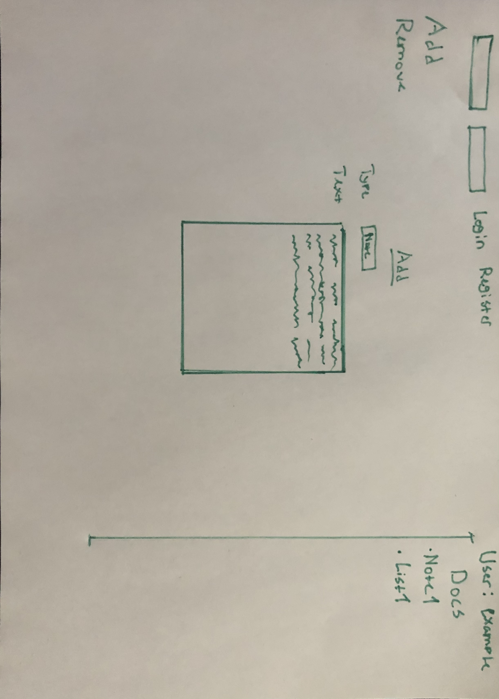

# Projektplan
## 1. Projektbeskrivning (Beskriv vad sidan ska kunna göra). OnlineBiblus är ett SQL baserat bibliotek där jag kan lagra recensioner, listor, och diverse anteckningar. Tanken är att hemsidan ska ha ett inloggsystem som stödjer fler än en användare med separata inloggningar och data som enbart visas för en användare. 
## 2. Vyer (visa bildskisser på dina sidor). 
## 3. Databas med ER-diagram (Bild på ER-diagram).
## 4. Arkitektur (Beskriv filer och mappar - vad gör/innehåller de?).
